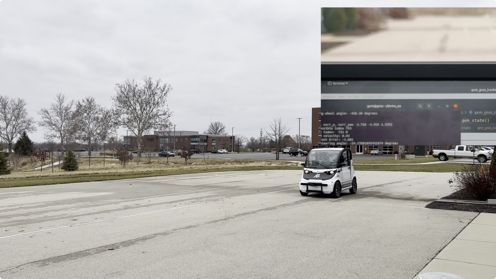

# Autonomous-Vehicle-Tracking-System
In this project, we implement a tracking system allowing vehicle to follow a figure 8 path on the outdoor track.

## Implementation

- Developed a recorder to record the desired path for the vehicle to follow.
- Implemented a pure pursuit system to enable the vehicle to determine the next point to follow, and combined it with a PID controller to control the vehicle.

## [Demo](https://www.bilibili.com/video/BV1E24y1S72u/?vd_source=5de4fff2ab70b4aff4fed44ebb521596)

